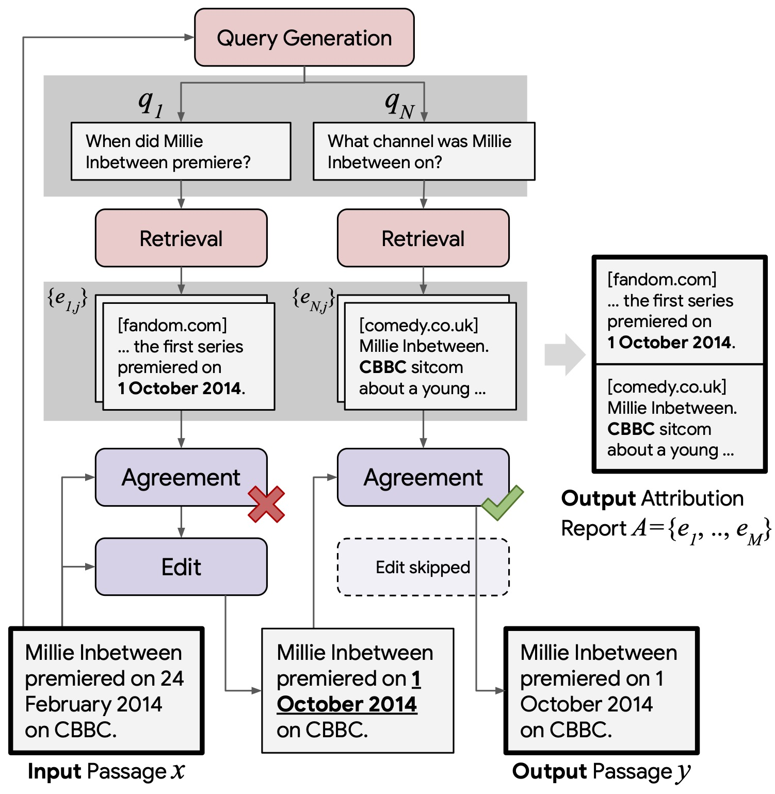

# RARR: Researching and Revising What Language Models Say, Using Language Models

Welcome! This repository contains the code for a public implementation of the methods in the paper [RARR: Researching and Revising What Language Models Say, Using Language Models](https://arxiv.org/abs/2210.08726) from CMU, Google Research, and UC Irvine.

RARR addresses the attribution and factuality problems in large language models (LLMs) in a post-hoc manner by retriving evidence to attribute the LLM's output and editing the output to be facutally consistent with the evidence.
RARR uses large language models themselves to do the editing.

The techniques in this repository are quite general so if you are working on any task in which you wish to use LLMs to edit the output of LLMs (*e.g.*, removing bias, fixing toxing outputs, etc.), you should find it useful to use this repository as a starting point.

## Getting Started

### Environment Setup
We recommend using [Poetry](https://python-poetry.org/docs/) to install the necessary packages. 
After installing poetry, run `poetry install` in the repository root.
Then run `poetry shell` to launch the virtual environment.
Alternatively, you can install using the `requirements.txt` file which is derived from the `poetry.lock` file.

Download the following:
```bash
python -m spacy download en_core_web_sm
# FastText model for language identification
wget https://dl.fbaipublicfiles.com/fasttext/supervised-models/lid.176.bin
```

Add the following to your `~/.bash_profile`:
```bash
export FASTTEXT_PATH="/absolute/path/to/lid.176.bin"
```

We use [black](https://github.com/psf/black) to automatically format code.

### Setting up APIs
#### **Bing API**
We use the Bing API to search for relevant webpages to attribute the output of LLMs.
To setup a Bing API, create an [Azure account](https://portal.azure.com/#home), then [create a subscription](https://portal.azure.com/#view/Microsoft_Azure_Billing/SubscriptionsBlade), then [create a Bing Search API](https://portal.azure.com/#create/microsoft.bingsearch) using the subscription you created.
We recommend using the [S2 pricing plan](https://www.microsoft.com/en-us/bing/apis/pricing) which costs $3 every 1000 calls.

After setting up your Bing API, you will be given two API keys.
Copy one of the keys and add the following line to your `~/bash_profile`:
```bash
export AZURE_SEARCH_KEY="<BING_API_KEY>"
```

#### **OpenAI API**
We use the LLMs from the OpenAI API to verify and edit the claims.
Add the following line to your `~/.bash_profile`:
```bash
export OPENAI_API_KEY="<OPENAI_API_KEY>"
```

## Using RARR to Improve Attribution and Factuality of LLMs
<!--  -->
<p align="center"></p>

<p align="center">An overview of RARR, which improves attribution via research and revision.</p>

RARR (Retrofit Attribution using Research and Revision), improves the attribution of langauge models by taking their outputs and applying a retrieve-and-edit approach.
Given the output of a LLM (*i.e.*, claim), RARR applies the following steps:

1. [Query Generation](utils/question_generation.py): We generate a set of queries using a prompted LLM to interrogate the claim.
2. [Search](utils/search.py): For each query, we use Bing to search for relevant webpages, then apply a passage extractor to retrieve the most relevant passage(s) for each question as evidence.
3. We iteratively use each evidence to edit the claim in two steps.

    1. [Agreement Gate](utils/agreement_gate.py): We use a prompted LLM to decide whether the current evidence contradicts the information in the claim. If so, we move to editing. If not, we skip editing.

    2. [Editing](utils/editor.py): We use a prompted LLM to edit the claim so it is consistent with the current evidence.

4. [Generating Attribution Report](utils/evidence_selection.py): We extract a subset of the retrieved evidence to serve as an attribution report for the claim (*i.e.*, a citation for information in the claim).

### Editing a File of Claims
Given a JSONLines file, where each line is a dictionary with the key `input_info` and under this is a dictionary with a claim field. For example:
`{"input_info": {"claim": "Michael Jordan played for the LA Lakers.}}`
```bash
python run_editor_sequential.py \
  --input_file "path/to/input_file.jsonl" \
  --output_file "path/to/output_file.jsonl" \
  --model_name "text-davinci-003" \
  --claim_field "claim"
```

### Editing a Single Claim
```python
import json
from run_editor_sequential import run_editor_one_instance

claim = "Michael Jordan played for the LA Lakers."
result = run_editor_one_instance(claim=claim, model="text-davinci-003")
print(json.dumps(result, indent=4))
```

## Launcing an Interactive Demo of RARR
To serve a demo of RARR using streamlit, run:
```bash
streamlit run launch_editor_demo.py --server.baseUrlPath rarr --server.fileWatcherType none
```
and go to the URL that is displayed after running the command.

## Citation
If you find this repository useful, please cite the RARR paper.
```
@article{Gao2022RARRRA,
  title={RARR: Researching and Revising What Language Models Say, Using Language Models},
  author={Luyu Gao and Zhuyun Dai and Panupong Pasupat and Anthony Chen and Arun Tejasvi Chaganty and Yicheng Fan and Vincent Zhao and N. Lao and Hongrae Lee and Da-Cheng Juan and Kelvin Guu},
  journal={ArXiv},
  year={2022},
  volume={abs/2210.08726},
  url={https://arxiv.org/abs/2210.08726},
}
```